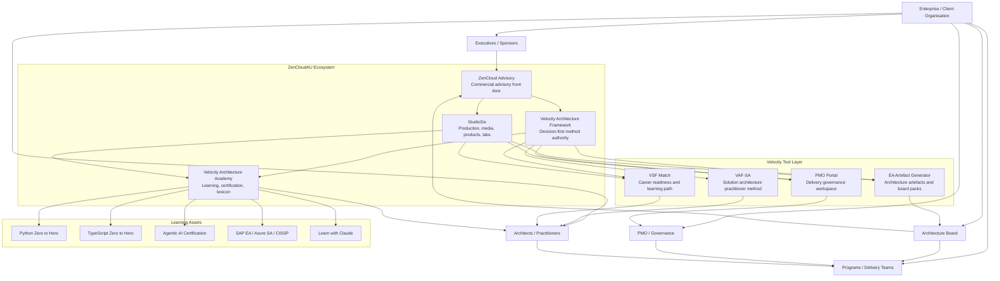
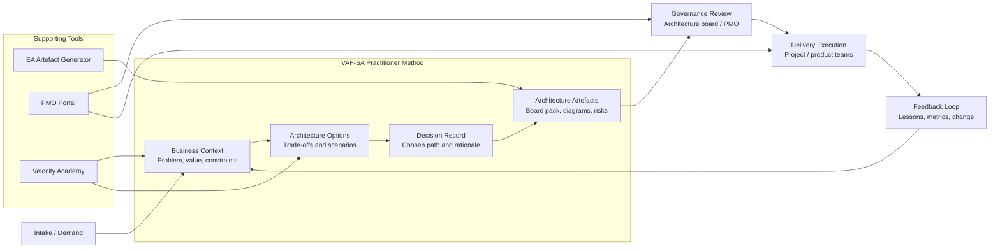
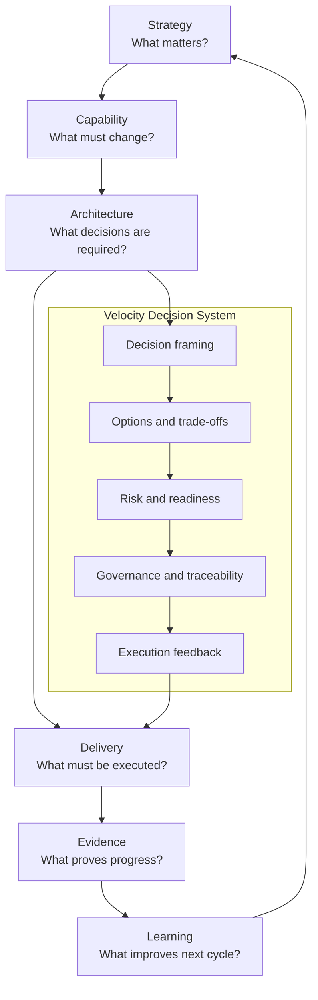
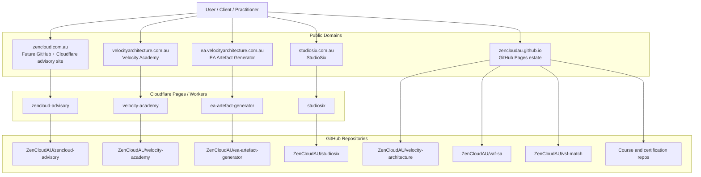
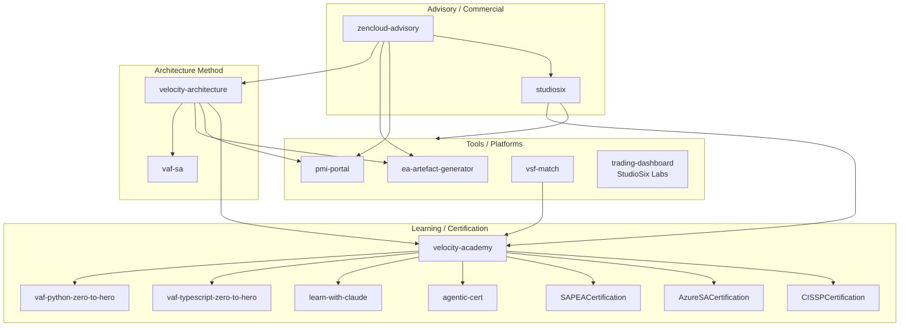

# Velocity Architecture Ecosystem

## Enterprise and Solution Architecture Overview

## 1. Purpose

The Velocity Architecture ecosystem is a decision-first architecture and delivery operating model connecting advisory, method, learning, tooling, and execution.

It exists to solve a common enterprise problem: organisations do not only have an artefact problem; they have a decision-flow problem.

Velocity Architecture provides the framework, tools, courses, and delivery surfaces required to move from fragmented architecture activity to structured decision execution.

## 2. Ecosystem Thesis

Velocity Architecture connects enterprise architecture, business architecture, solution architecture, PMO / program delivery, AI-assisted delivery, learning, certification, and client advisory.

Working line:

```text
ZenCloud advises.
StudioSix produces.
Velocity decides.
```

## 3. Brand and Platform Roles

| Layer | Role | Primary Purpose |
|---|---|---|
| ZenCloud Advisory | Commercial front door | Client engagement, advisory, consulting, enterprise architecture, cloud, security, AI delivery |
| StudioSix | Production studio | Product studio, media, research, training, digital products, AI tooling |
| Velocity Architecture Framework | Method authority | Decision-first architecture framework and operating model |
| Velocity Architecture Academy | Learning hub | Courses, certifications, practitioner learning, lexicon, books |
| EA Artefact Generator | Tool layer | Structured EA artefact generation and board-pack support |
| PMO Portal | Delivery governance | Intake, governance, transparency, delivery lifecycle, program execution |
| VAF-SA | Solution architecture method | Practitioner method for solution architects |
| VSF Match | Career readiness | CV/JD alignment, capability scoring, personalised learning path |
| Course Repos | Learning assets | Python, TypeScript, certification, and AI-assisted development learning |

## 4. Enterprise Architecture Ecosystem Diagram



## 5. Solution Architecture View

The solution architecture layer converts enterprise direction into delivery-ready decisions.

It focuses on scope definition, decision capture, architecture options, trade-off analysis, risk and control mapping, board-pack generation, delivery governance, and traceability from decision to execution.

VAF-SA sits as the practitioner method for solution architects, while the EA Artefact Generator and PMO Portal provide supporting execution tools.



## 6. Decision-First Operating Model



## 7. Deployment and Domain Routing View



## 8. Repo-to-Capability Map



## 9. Enterprise Architecture Description

The Velocity Architecture ecosystem is structured around separation of concerns.

ZenCloud Advisory operates as the client-facing advisory layer. It provides commercial engagement, enterprise architecture advisory, cloud strategy, security architecture, AI delivery strategy, and executive-facing consulting.

StudioSix operates as the production and productisation layer. It creates the digital products, training assets, media, research, tools, and labs that support the broader Velocity ecosystem.

Velocity Architecture Framework is the method authority. It defines the decision-first architecture model, governance patterns, architecture practices, and operating model principles used across enterprise architecture, solution architecture, PMO, and delivery.

Velocity Architecture Academy is the learning layer. It turns the framework into teachable courses, certification pathways, books, lexicon, and practitioner resources.

The tooling layer includes the EA Artefact Generator, PMO Portal, VAF-SA, and VSF Match. These tools operationalise the framework by helping practitioners generate artefacts, manage governance, assess capability, and connect learning to delivery outcomes.

This creates a complete architecture operating model:

```text
Advisory -> Method -> Learning -> Tooling -> Delivery -> Feedback
```

## 10. Solution Architecture Description

At the solution architecture level, VAF-SA provides the practitioner method for moving from business demand to delivery-ready architecture.

A solution engagement starts with intake and context. The architect frames the business problem, clarifies constraints, identifies value, and defines the decision scope. Options are then developed and compared through trade-offs, risks, dependencies, delivery readiness, and governance implications.

The chosen direction is captured as a decision record and converted into architecture artefacts. These may include board packs, diagrams, risk summaries, design notes, option papers, traceability matrices, and implementation guardrails.

The EA Artefact Generator supports structured artefact production. The PMO Portal supports delivery governance, intake, status visibility, and execution transparency. The Academy supports practitioner development and method learning.

The architecture loop does not end at approval. Delivery execution generates evidence and feedback. That feedback improves the method, the tooling, the learning material, and the next architecture decision cycle.

## 11. Migration Context for ZenCloud

Before moving `zencloud.com.au` from Squarespace to GitHub and Cloudflare, the target architecture should be:

```text
zencloud.com.au
-> ZenCloud Advisory
-> Commercial front door
-> Routes to Velocity, StudioSix, Academy, EA tools, PMO, VAF-SA
```

The ZenCloud site should act as the advisory front door, not a dumping ground for all ecosystem content.

Recommended top navigation:

```text
Home
Advisory
Services
Velocity
StudioSix
Academy
Tools
Insights
Contact
```

Recommended routing:

```text
Velocity Framework -> velocityarchitectureframework.com or velocityarchitecture.com.au
Academy -> velocityarchitecture.com.au
EA Artefact Generator -> ea.velocityarchitecture.com.au
StudioSix -> studiosix.com.au
VAF-SA -> zencloudau.github.io/vaf-sa/
VSF Match -> zencloudau.github.io/vsf-match/
GitHub -> github.com/ZenCloudAU
```

## 12. Executive Summary

Velocity Architecture is now a complete architecture ecosystem, not a single framework.

It contains a commercial advisory front door, a production studio, a decision-first architecture framework, a learning academy, a solution architecture method, an artefact generation tool, a PMO governance workspace, a career readiness engine, and practical coding and certification courses.

The system is coherent when each layer keeps its role:

```text
ZenCloud advises.
StudioSix produces.
Velocity decides.
Academy teaches.
Tools operationalise.
PMO governs.
Practitioners execute.
Feedback improves the system.
```
